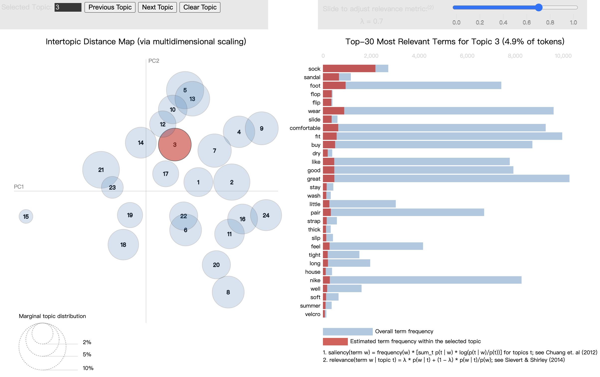

CU Boulder MSDS course work  
DTSA 5799 Unupervised Text Classification for Marketing Analytics  

## Amazon Product Review . Topic Model

### Tast & Data

The purpose of this project is to train a suitable **topic model** to cluster consumer reviews of products. After classification, feasible marketing and product insights can be extracted from each topic.

The [Amazon product database](https://cseweb.ucsd.edu/~jmcauley/datasets/amazon/links.html) used in this project comes from Prof. Julian McAuley at UC-San Diego. This database contains **meta data** about product information ('asin', 'related', 'title', 'price', 'salesRank', 'imUrl', 'brand', 'categories') and **product reviews** ('reviewID', 'asin', 'reviewerName', 'reviewText', 'helpful', 'overall', 'summary', 'unixReviewTime', 'reviewTime'), including 142.8 million reviews spanning from May 1996 to July 2014.

|||
|---|---|
|'nike' products |13380 reviews filtered by sales rank < 1e5 |

 

### Model & Evaluation

beta = 0.1, .05, 1  
alpha = 0.5*(1/k), 1/k, 5*(1/k)  
k = 1, 6, 11, 16, 21, 26, 31, 36, 41, 46  
dtms = dtm_bg, dtm_sm
|||
|---|---|
| beta, alpha = 0.1, 0.5*(1/k) | beta, alpha = 0.1, 1*(1/k) |
|||
| beta, alpha = 1, 0.5*(1/k) | beta, alpha = 1, 1*(1/k) |
|||
dtm_bg
 

### Final Model

k, beta, alpha = 24, 1, 1/24 

 

### Topic Reviews Analysis

example

**Topic: 18_return_order_pay**

 
 

|Most Reviewed Products| Features/Issues |Recommendations|
|---|---|---|
|❧ Nike Men's Air Jordan 11 Retro Basketball Shoe |✖ Counterfeit or defective items ✖ Dissatisfaction with shipping and packaging |➤ Enhance quality control measures to prevent counterfeit products from entering the market ➤ Improve packaging materials to ensure products are not damaged during shipping |
|❧ Nike Air Monarch IV Men's Cross Training Shoes |✔ Comfortable and durable ✖ Noise issue from the soles |➤ Address the noise issue immediately and provide after-sales repair services |
|❧ Nike Men's Benassi Swoosh Slide Sandal |✖ Shoes are too narrow, leading to exchanges or returns | ➤ Re-evaluate the standard sizing of the shoes or expand the range of product sizes |

 

**Topic: 21_watch_band_wrist**

 
 

|Most Reviewed Products | Features/Issues | Recommendations |
|---|---|---|
|❧ Nike Men's C0021-001 Hammer Watch ❧ Nike Unisex Watch WR0139-021 ❧ Nike Midsize WR0127-001 Triax Speed 100 Super Watch |✔ Large watch face ✔ Easy-to-read fonts ✖ Too large and heavy ✖ Unsuitable for smaller wrists ✖ Watchbands need better material and durability |➤ Offer more size options for different wrist sizes ➤ Use lighter, more durable materials to reduce watch weight ➤ Improve watchband material for easier cleaning and durability ➤ Provide convenient return/exchange policies and after-sales services |
